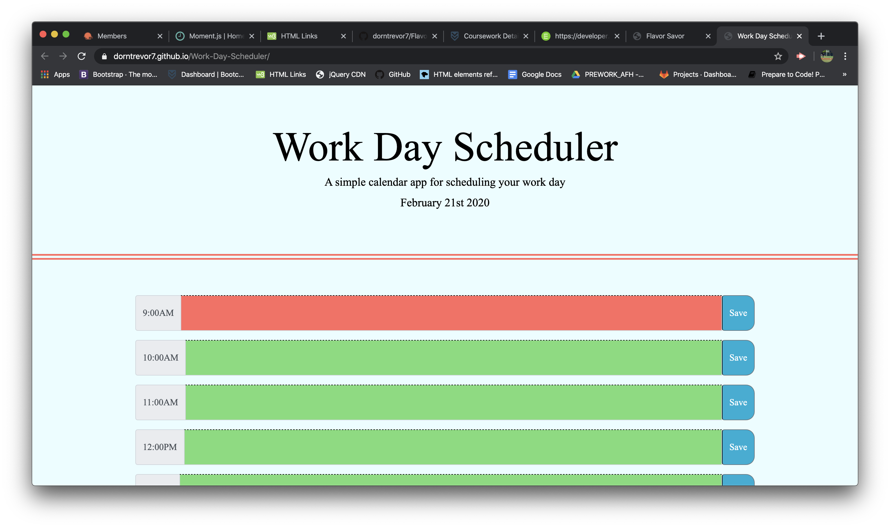

# Work Day Scheduler

In this project I created a work day scheduler with [Bootstrap](https://getbootstrap.com/) and [moment.js](https://momentjs.com/) that allows you to:

* Save important things/ tasks you need to get done within the time frame
* Display the saved text no matter if you close out the tab
* Knows the time and day:

    * Grey = Past
    * Red = Present
    * Green = future

 

The following image demonstrates on the computer:

 

Here's the link: [Work Day Scheduler](https://dorntrevor7.github.io/Work-Day-Scheduler/)